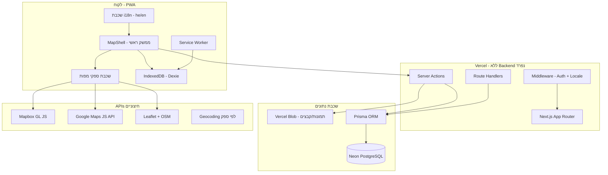
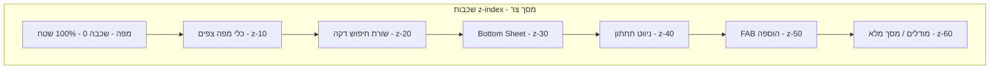

# HiddenSpots — תוכנית יישום Production

> פלטפורמה אישית ושיתופית לניהול מיקומי טבע. ממשק מפה ראשי. נפרס על Vercel בלבד — ללא שרת backend נפרד.

**שפה ראשית:** עברית (HE) · **שפה משנית:** אנגלית (EN) · **כיוון:** RTL בעברית, LTR באנגלית

**טכנולוגיות:** Next.js (App Router) · TypeScript · Tailwind CSS · PostgreSQL · Prisma · NextAuth · Mapbox / Google Maps / Leaflet · PWA

**סטטוס:** פרויקט חדש (ריפו ריק)

---

## תוכן עניינים

1. [סקירת ארכיטקטורה](#1-סקירת-ארכיטקטורה)
2. [בינלאומיות — עברית ראשונה (i18n)](#2-בינלאומיות--עברית-ראשונה-i18n)
3. [החלטות טכנולוגיות](#3-החלטות-טכנולוגיות)
4. [מערכת מפות רב-ספקית](#4-מערכת-מפות-רב-ספקית)
5. [סכמת מסד נתונים](#5-סכמת-מסד-נתונים)
6. [אימות והרשאות](#6-אימות-והרשאות)
7. [מבנה האפליקציה](#7-מבנה-האפליקציה)
8. [מודולי פיצ'רים (כיסוי מלא של המפרט)](#8-מודולי-פיצרים)
9. [API ו-Server Actions](#9-api-ו-server-actions)
10. [PWA ואסטרטגיית Offline](#10-pwa-ואסטרטגיית-offline)
11. [מערכת עיצוב ו-UX](#11-מערכת-עיצוב-ו-ux)
12. [אבטחה ופרטיות](#12-אבטחה-ופרטיות)
13. [ביצועים ו-Caching](#13-ביצועים-ו-caching)
14. [פריסה ב-Vercel](#14-פריסה-ב-vercel)
15. [אסטרטגיית בדיקות](#15-אסטרטגיית-בדיקות)
16. [משתני סביבה](#16-משתני-סביבה)
17. [שלבי יישום](#17-שלבי-יישום)
18. [רישום סיכונים](#18-רישום-סיכונים)
19. [מובייל ומסכים צרים — מדריך מלא](#19-מובייל-ומסכים-צרים--מדריך-מלא)

---

## 1. סקירת ארכיטקטורה



### עקרונות ארכיטקטוניים

| עקרון | יישום |
|-------|--------|
| **עברית ראשונה** | ברירת מחדל `he`, RTL, כל מחרוזות UI מתורגמות |
| מפה כממשק ראשי | `/he/app` ו-`/en/app` — מפה במסך מלא; פאנלים נפתחים מעל |
| פרטי כברירת מחדל | כל ישות מקושרת ל-`userId`; שיתוף מפורש בלבד |
| Vercel בלבד | Server Actions + Route Handlers — ללא Express/Fastify |
| מפות רב-ספקיות | `MapAdapter` אחיד; Mapbox / Google / Leaflet לפי בחירת משתמש |
| ניהול לטווח ארוך | סכמה מנורמלת, soft delete, גיבוי מלא |
| **Mobile-first** | עיצוב מתחיל ב-320px; מסכים צרים הם ה-baseline, לא edge case (ראו §19) |

---

## 2. בינלאומיות — עברית ראשונה (i18n)

**דרישה:** כל ממשק המשתמש בעברית מלאה. תמיכה באנגלית כשפה משנית. עברית היא ברירת המחדל בכל מקום.

### 2.1 ספרייה: `next-intl`

| פרמטר | ערך |
|-------|-----|
| ספרייה | **next-intl** (תואם App Router + Server Components) |
| שפות נתמכות | `he` (ראשית), `en` (משנית) |
| ברירת מחדל | `he` |
| `localePrefix` | `always` — כל URL כולל locale: `/he/app`, `/en/app` |
| כיוון | `he` → `dir="rtl"`, `en` → `dir="ltr"` |
| זיהוי שפה | cookie `NEXT_LOCALE` → `Accept-Language` → `he` |

### 2.2 מבנה קבצי תרגום

```
src/
├── i18n/
│   ├── config.ts              # locales, defaultLocale: 'he'
│   ├── request.ts             # getRequestConfig ל-next-intl
│   └── routing.ts             # defineRouting + navigation helpers
├── messages/
│   ├── he/                    # עברית — קובץ לכל namespace
│   │   ├── common.json        # כפתורים, פעולות כלליות
│   │   ├── nav.json           # ניווט
│   │   ├── map.json           # כלי מפה, שכבות, חיפוש
│   │   ├── locations.json     # מיקומים, קטגוריות, שדות
│   │   ├── collections.json   # אוספים, תיקיות
│   │   ├── visits.json        # ביקורים
│   │   ├── trips.json         # תכנון טיולים
│   │   ├── sharing.json       # שיתוף והרשאות
│   │   ├── import-export.json # ייבוא/ייצוא
│   │   ├── dashboard.json     # לוח בקרה
│   │   ├── settings.json      # הגדרות
│   │   ├── auth.json          # התחברות, הרשמה
│   │   ├── onboarding.json    # אונבורדינג
│   │   ├── errors.json        # הודעות שגיאה
│   │   ├── validation.json    # ולידציה (Zod messages)
│   │   └── pwa.json           # התקנה, offline
│   └── en/                    # אנגלית — אותם namespaces
│       └── ... (אותו מבנה)
```

**כלל:** אין מחרוזות קשיחות בקוד. הכל דרך `useTranslations()` / `getTranslations()`.

### 2.3 דוגמאות מחרוזות עבריות (מלאות)

#### קטגוריות מיקום (`locations.json`)

```json
{
  "categories": {
    "SPRING": "מעיין",
    "WATERFALL": "מפל",
    "VIEWPOINT": "נקודת תצפית",
    "HIKING_TRAIL": "שביל הליכה",
    "BEACH": "חוף",
    "PICNIC_AREA": "אזור פיקניק",
    "CAMPING_SITE": "אתר קמפינג",
    "BIKE_TRAIL": "שביל אופניים",
    "PHOTOGRAPHY_SPOT": "נקודת צילום",
    "FISHING_SPOT": "נקודת דיג",
    "SUNRISE_LOCATION": "מיקום זריחה",
    "SUNSET_LOCATION": "מיקום שקיעה",
    "HIDDEN_GEM": "פנינה נסתרת",
    "CUSTOM": "מותאם אישית"
  },
  "difficulty": {
    "EASY": "קל",
    "MODERATE": "בינוני",
    "HARD": "קשה",
    "EXPERT": "מומחה"
  },
  "privacy": {
    "PRIVATE": "פרטי",
    "SHARED": "משותף",
    "PUBLIC": "ציבורי",
    "SECRET": "סודי"
  }
}
```

#### ניווט (`nav.json`)

```json
{
  "map": "מפה",
  "list": "רשימה",
  "collections": "אוספים",
  "trips": "טיולים",
  "visits": "ביקורים",
  "dashboard": "לוח בקרה",
  "import": "ייבוא",
  "export": "ייצוא",
  "settings": "הגדרות",
  "search": "חיפוש מיקומים...",
  "addLocation": "הוסף מיקום"
}
```

#### מפה (`map.json`)

```json
{
  "addByClick": "לחץ על המפה להוספת מיקום",
  "cluster": "קיבוץ סמנים",
  "satellite": "לוויין",
  "terrain": "טופוגרafiה",
  "streets": "רחובות",
  "fullscreen": "מסך מלא",
  "measure": "מדידת מרחק",
  "radiusSearch": "חיפוש ברדיוס",
  "areaSearch": "חיפוש בשטח",
  "polygonSelect": "בחירה במצולע",
  "layers": "שכבות",
  "nearby": "מיקומים בקרבת מקום",
  "providers": {
    "mapbox": "Mapbox",
    "google": "Google Maps",
    "leaflet": "OpenStreetMap"
  }
}
```

### 2.4 RTL / LTR

```tsx
// src/app/[locale]/layout.tsx
<html lang={locale} dir={locale === 'he' ? 'rtl' : 'ltr'}>
```

| נושא | עברית (RTL) | אנגלית (LTR) |
|------|-------------|--------------|
| Tailwind | `rtl:` variants, `ms-`/`me-` במקום `ml-`/`mr-` | סטנדרטי |
| אייקונים כיווניים | `rtl:rotate-180` על חצים | רגיל |
| מפה | כלי מפה בצד שמאל (במקום ימין ב-LTR) | ימין |
| Bottom sheet | נפתח מלמטה (זהה) | זהה |
| Command palette | `Ctrl+K` / `⌘K` + תווית עברית | זהה |
| shadcn/ui | `tailwindcss-rtl` plugin או logical properties | רגיל |

### 2.5 פונטים לעברית

| שימוש | פונט | הערה |
|-------|------|------|
| גוף טקסט | **Heebo** או **Assistant** | תמיכה מלאה בעברית, קריא במובייל |
| כותרות | **Rubik** או **Fraunces** | משקלים 400–700 |
| מונוספייס (קואורדינטות) | **IBM Plex Mono** | תמיכה בעברית + מספרים |
| אנגלית בלבד (fallback) | Geist / Inter | כשהמשתמש בוחר `en` |

```tsx
// next/font/google
import { Heebo, Rubik } from 'next/font/google';
const heebo = Heebo({ subsets: ['hebrew', 'latin'], variable: '--font-sans' });
```

### 2.6 תאריכים, מספרים ויחידות

| סוג | עברית | אנגלית |
|-----|-------|--------|
| תאריכים | `date-fns` + locale `he` — פורמט: `5 ביוני 2026` | `June 5, 2026` |
| שעות | 24 שעות (ברירת מחדל ב-HE) | 12/24 לפי הגדרה |
| מרחק | ק"מ / מטר | km / m |
| דירוג | כוכבים + "מתוך 5" | "out of 5" |
| מספרים | ספרות מערביות (1,234.5) | זהה |

### 2.7 ולידציה ושגיאות בעברית

```typescript
// src/lib/validations/location.ts
import { z } from 'zod';

export function createLocationSchema(t: (key: string) => string) {
  return z.object({
    title: z.string().min(1, t('validation.titleRequired')),
    latitude: z.number({ error: t('validation.coordsRequired') }),
    // ...
  });
}
```

הודעות Zod נטענות מ-`messages/{locale}/validation.json` — לא hardcoded.

### 2.8 שפה בהגדרות משתמש

```prisma
model UserSettings {
  // ...
  locale    String @default("he")  // "he" | "en"
}
```

- משתמש חדש → עברית
- החלפת שפה בהגדרות → עדכון cookie + redirect ל-`/{locale}/...`
- שמירה ב-DB לסנכרון בין מכשירים

### 2.9 SEO ומטא-דאטה

```typescript
// generateMetadata per locale
export async function generateMetadata({ params }) {
  const t = await getTranslations({ locale: params.locale, namespace: 'metadata' });
  return {
    title: t('title'),        // "HiddenSpots — המפה האישית שלך לטבע"
    description: t('description'),
    openGraph: { locale: params.locale === 'he' ? 'he_IL' : 'en_US' },
  };
}
```

### 2.10 PWA Manifest — דו-לשוני

```json
{
  "name": "HiddenSpots — מיקומי טבע",
  "short_name": "HiddenSpots",
  "description": "ניהול אישי ושיתופי של מיקומי טבע",
  "lang": "he",
  "dir": "rtl",
  "start_url": "/he/app"
}
```

### 2.11 מפתחות קיצור — תוויות בעברית

| פעולה | Windows | Mac | תווית UI |
|-------|---------|-----|----------|
| חיפוש | `Ctrl+K` | `⌘K` | "חיפוש (Ctrl+K)" |
| מיקום חדש | `Ctrl+N` | `⌘N` | "מיקום חדש" |
| שמירה | `Ctrl+S` | `⌘S` | "שמור" |

### 2.12 בדיקות i18n

- [ ] כל namespace קיים ב-`he` וב-`en`
- [ ] אין מפתחות חסרים (סקריפט CI: `check-translations.ts`)
- [ ] RTL: Playwright screenshots ב-`he` — פאנלים, טפסים, מפה
- [ ] LTR: אותו ב-`en`
- [ ] הודעות שגיאת שרת בעברית (Server Actions)

### 2.13 NL Search — עברית ראשונה

חיפוש שפה טבעית יתמוך בעברית לפני אנגלית:

| שאילתה (HE) | מיפוי פילטר |
|-------------|-------------|
| "מפלים ידידותיים לכלבים" | category=WATERFALL, dogFriendly=true |
| "מקומות שלא ביקרתי השנה" | isVisited=false, date filter |
| "לידי עכשיו" | nearby radius from GPS |

Phase 2: אופציונלי AI (Vercel AI SDK) עם prompt בעברית.

---

## 3. החלטות טכנולוגיות

| שכבה | בחירה | נימוק |
|------|--------|--------|
| Framework | **Next.js 16** (App Router) | Server Components, Vercel-native |
| שפה | **TypeScript** (strict) | בטיחות טיפוסים |
| עיצוב | **Tailwind CSS 4** + **shadcn/ui** | SaaS פרימיום, dark/light, RTL |
| i18n | **next-intl** | עברית ראשונה, SSG/SSR per locale |
| DB | **Neon PostgreSQL** | Serverless, branching |
| ORM | **Prisma** | Migrations, type-safe |
| Auth | **NextAuth.js v5** | Google + magic link (אימייל בעברית) |
| מפות | **Mapbox** + **Google Maps** + **Leaflet** | 3 ספקים, בחירת משתמש |
| אחסון | **Vercel Blob** | תמונות, קבצים |
| PWA | **Serwist** | offline, install |
| טפסים | **react-hook-form** + **zod** | ולידציה מתורגמת |
| State | **Zustand** + **TanStack Query** | מפה + cache |
| גאו | **@turf/turf** | רדיוס, מצולע, מרחק |
| אנימציות | **Framer Motion** | מעברי פאנלים |
| פונטים | **Heebo** + **Rubik** | עברית מלאה |

---

## 4. מערכת מפות רב-ספקית

**דרישה:** Mapbox, Google Maps ו-Leaflet — כולם זמינים. המשתמש בוחר בהגדרות. אף ספק לא מוסר.

### 4.1 Map Adapter Pattern

```typescript
// src/lib/maps/types.ts
export type MapProvider = 'mapbox' | 'google' | 'leaflet';

export interface MapAdapter {
  provider: MapProvider;
  init(container: HTMLElement, options: MapInitOptions): void;
  destroy(): void;
  setCenter(lng: number, lat: number, zoom?: number): void;
  getBounds(): MapBounds;
  onClick(cb: (e: MapClickEvent) => void): void;
  addMarker(marker: MapMarker): string;
  updateMarker(id: string, marker: Partial<MapMarker>): void;
  removeMarker(id: string): void;
  setMarkers(markers: MapMarker[]): void;
  enableClustering(config: ClusterConfig): void;
  addLayer(layer: MapLayer): void;
  removeLayer(id: string): void;
  setStyle(style: MapStyle): void;
  enableDraw(mode: DrawMode): void;
  disableDraw(): void;
  fitBounds(bounds: MapBounds, padding?: number): void;
  resize(): void;
  project(lng: number, lat: number): { x: number; y: number };
  unproject(x: number, y: number): { lng: number; lat: number };
  setLanguage(locale: 'he' | 'en'): void; // תוויות מפה לפי שפה
}
```

### 4.2 מימושים

| קובץ | ספק | תלויות |
|------|-----|--------|
| `mapbox-adapter.ts` | Mapbox | `mapbox-gl`, `@mapbox/mapbox-gl-draw` |
| `google-adapter.ts` | Google Maps | `@googlemaps/js-api-loader`, `@googlemaps/markerclusterer` |
| `leaflet-adapter.ts` | Leaflet | `leaflet`, `leaflet.markercluster`, `leaflet-draw` |

### 4.3 שפה במפות

| ספק | הגדרת שפה |
|-----|-----------|
| Mapbox | `map.setLanguage('he')` |
| Google Maps | `language: 'he'` ב-loader |
| Leaflet/OSM | תוויות OSM; UI שלנו מתורגם בנפרד |

### 4.4 יכולות לפי ספק

| יכולת | Mapbox | Google | Leaflet |
|-------|--------|--------|---------|
| עיצוב וקטורי | כן | מוגבל | plugins |
| לוויין | כן | כן | שכבת tiles |
| טופוגרפיה | כן | כן | שכבת tiles |
| קיבוץ סמנים | supercluster | MarkerClusterer | markercluster |
| ציור מצולע/רדיוס | mapbox-gl-draw | drawing library | leaflet-draw |
| מדידת מרחק | turf + draw | geometry | leaflet-measure |
| Offline tiles | מצוין | מוגבל | cache מלא |
| ניתוב | Directions API | Directions API | OSRM |
| Street View | לא | כן | לא |

### 4.5 מבנה קומפוננטות

```
src/components/map/
├── MapShell.tsx
├── MapProviderContext.tsx
├── MapToolbar.tsx              # תוויות מ-map.json
├── MapSearchOverlay.tsx
├── MapLocationPopup.tsx
├── MapAddLocationPin.tsx
├── MapLayerPanel.tsx
├── MapMeasureTool.tsx
├── MapRouteLayer.tsx
└── providers/
    ├── MapboxMap.tsx
    ├── GoogleMap.tsx
    └── LeafletMap.tsx
```

---

## 5. סכמת מסד נתונים

### 5.1 Enums (ערכים ב-DB באנגלית, תצוגה מתורגמת ב-UI)

```prisma
enum LocationCategory {
  SPRING WATERFALL VIEWPOINT HIKING_TRAIL BEACH PICNIC_AREA
  CAMPING_SITE BIKE_TRAIL PHOTOGRAPHY_SPOT FISHING_SPOT
  SUNRISE_LOCATION SUNSET_LOCATION HIDDEN_GEM CUSTOM
}

enum DifficultyLevel { EASY MODERATE HARD EXPERT }
enum PrivacyLevel { PRIVATE SHARED PUBLIC SECRET }
enum SharePermission { VIEW COMMENT EDIT MANAGE }
enum MapProvider { MAPBOX GOOGLE LEAFLET }
enum MapStyle { STREETS SATELLITE TERRAIN }
enum Season { SPRING SUMMER FALL WINTER ALL_YEAR }
enum CellularQuality { NONE POOR FAIR GOOD EXCELLENT }
enum ParkingAvailability { NONE LIMITED AMPLE STREET LOT }
enum WaterAvailability { NONE NATURAL TAP SEASONAL }
enum ShadeAvailability { NONE PARTIAL FULL }
```

**חשוב:** נתוני משתמש (כותרת, תיאור, הערות) נשמרים בשפה שהמשתמש כתב — בדרך כלל עברית. Enums מתורגמים ב-UI בלבד.

### 5.2 ישויות עיקריות

- **User** — משתמש
- **Location** — מיקום (כל השדות מהמפרט)
- **LocationPhoto** — תמונות
- **Tag** / **LocationTag** — תגיות
- **ExternalLink** — קישורים חיצוניים
- **Attachment** — קבצים מצורפים
- **Collection** — אוספים + תיקיות (`parentId`)
- **Visit** / **VisitPhoto** — ביקורים
- **Trip** / **TripStop** — תכנון טיולים
- **Share** / **ShareGrant** — שיתוף והרשאות
- **SmartView** — תצוגות חכמות שמורות
- **ImportJob** — ייבוא
- **ActivityLog** — פעילות אחרונה
- **UserSettings** — הגדרות (כולל `locale`, `mapProvider`)

### 5.3 UserSettings (מורחב)

```prisma
model UserSettings {
  userId           String      @id
  user             User        @relation(fields: [userId], references: [id])
  locale           String      @default("he")
  mapProvider      MapProvider @default(MAPBOX)
  mapStyle         MapStyle    @default(STREETS)
  defaultZoom      Float       @default(10)
  defaultCenterLat Float?      @default(31.5)   // ישראל — ברירת מחדל
  defaultCenterLng Float?      @default(34.75)
  clusterMarkers   Boolean     @default(true)
  theme            String      @default("system")
  offlineEnabled   Boolean     @default(true)
}
```

### 5.4 Location — כל השדות

| שדה | תיאור |
|-----|--------|
| title | שם המיקום |
| description | תיאור |
| latitude / longitude | קואורדינטות |
| address | כתובת |
| category | קטגוריה |
| difficulty | רמת קושי |
| accessibilityNotes | נגישות |
| parking | חניה |
| water | מים |
| shade | צל |
| cellular | קליטה סלולרית |
| familyFriendly | ידידותי למשפחות |
| dogFriendly | ידידותי לכלבים |
| campingAllowed | קמפינג מותר |
| recommendedSeason | עונה מומלצת |
| recommendedHours | שעות מומלצות |
| privateNotes | הערות פרטיות |
| isFavorite / isBucketList / isVisited | סטטוסים |
| privacy / isSecret | פרטיות ומיקומים סודיים |
| visitCount / lastVisitedAt / averageRating | סטטיסטיקות |

---

## 6. אימות והרשאות

### 6.1 NextAuth v5

- **ספקים:** Google OAuth, אימייל (Resend magic link)
- **אימיילים:** תבניות בעברית (נושא: "התחברות ל-HiddenSpots")
- **Middleware:** הגנת `/[locale]/app/*` + locale detection

### 6.2 שכבות הרשאה

| שכבה | מנגנון |
|------|--------|
| הגנת routes | Middleware — session |
| Server Actions | `auth()` — חובה |
| בעלות | `userId` בכל שאילתה |
| שיתוף | `Share` + `ShareGrant` |
| מיקומים סודיים | fuzzing קואורדינטות |
| קישורים ציבוריים | `/[locale]/share/[token]` |

### 6.3 רמות הרשאה (מתורגמות)

| Enum | עברית |
|------|--------|
| VIEW | צפייה |
| COMMENT | תגובה |
| EDIT | עריכה |
| MANAGE | ניהול |

### 6.4 רמות פרטיות

| Enum | עברית | התנהגות |
|------|--------|----------|
| PRIVATE | פרטי | בעלים בלבד |
| SHARED | משותף | מוזמנים + קישור |
| PUBLIC | ציבורי | כל מי שיש קישור |
| SECRET | סודי | קואורדינטות מטושטשות |

---

## 7. מבנה האפליקציה

```
HiddenSpots/
├── prisma/
├── public/
│   ├── manifest.json          # lang: he, dir: rtl
│   └── icons/
├── src/
│   ├── app/
│   │   └── [locale]/          # he | en
│   │       ├── layout.tsx       # dir, lang, fonts
│   │       ├── page.tsx         # דף נחיתה
│   │       ├── (auth)/
│   │       │   ├── login/
│   │       │   └── register/
│   │       ├── app/             # אפליקציה מחוברת
│   │       │   ├── layout.tsx   # MapShell
│   │       │   ├── page.tsx     # מפה — ממשק ראשי
│   │       │   ├── locations/
│   │       │   ├── collections/
│   │       │   ├── trips/
│   │       │   ├── visits/
│   │       │   ├── dashboard/
│   │       │   ├── import/
│   │       │   ├── export/
│   │       │   └── settings/
│   │       │       ├── page.tsx
│   │       │       ├── map/
│   │       │       ├── language/  # בורר שפה
│   │       │       └── account/
│   │       └── share/[token]/
│   ├── messages/he/ + en/
│   ├── i18n/
│   ├── components/
│   ├── lib/
│   └── middleware.ts            # auth + locale
├── next.config.ts
└── package.json
```

### 7.1 פריסת UX (מפה במרכז)

#### דסקטופ / טאבלט (≥768px)

```
┌─────────────────────────────────────────────────────────┐
│  [לוגו]  [חיפוש]  [סינון]  [שכבות]  [+]  [משתמש]       │
├─────────────────────────────────────────────────────────┤
│                    מפה — מסך מלא                        │
│   ┌──────────┐                              ┌────────┐ │
│   │ פרטי     │                              │ שכבות  │ │
│   │ מיקום    │                              │ אוספים │ │
│   └──────────┘                              └────────┘ │
└─────────────────────────────────────────────────────────┘
```

#### מובייל — מסך צר (320px–429px) — **פריסה ראשית**

```
┌──────────────────────┐  ← 320px (iPhone SE, מכשירים ישנים)
│ [☰]  חיפוש...  [👤] │  ← שורת חיפוש דקה, 48px גובה
├──────────────────────┤
│                      │
│      מפה 100dvh      │  ← המפה תמיד רואה מקסימום שטח
│                      │
│  ┌────────────────┐  │
│  │ כרטיס מיקום    │  │  ← bottom sheet (snap: 80px / 50% / 95%)
│  │ (peek)         │  │
│  └────────────────┘  │
│ [🗺][📋][📁][···] [+] │  ← ניווט 4+FAB / 56px מינימום
└──────────────────────┘
     ▲ safe-area-bottom
```

**עקרון:** במסכים צרים אין side panels — הכל bottom sheet או מסך מלא.

---

## 8. מודולי פיצ'רים

### 8.1 ניהול מיקומים אישי

| פיצ'ר | יישום |
|-------|--------|
| מיקומים ללא הגבלה | clustering + pagination |
| יצירה/עריכה/מחיקה | Server Actions + soft delete |
| מועדפים | `isFavorite` |
| רשימת משאלות | `isBucketList` |
| ביקרתי | `isVisited` |
| הערות אישיות | `privateNotes` |
| תגיות | Tag + LocationTag |
| קטגוריות | enum + custom |
| חיפוש | full-text + command palette |
| סינון | קטגוריה, תגיות, קושי, עונה, תכונות |
| מיון | תאריך, שם, מרחק, ביקורים, דירוג |
| אוספים | Collection |
| תיקיות | parentId |
| תצוגות חכמות | SmartView |

### 8.2 פרטי מיקום — כל השדות

טופס בפאנל צד עם סקציות:

1. **פרטים בסיסיים** — שם, תיאור, קטגוריה, קואורדינטות, כתובת
2. **מאפיינים** — קושי, נגישות, חניה, מים, צל, קליטה, משפחה/כלב/קמפינג
3. **מתי לבקר** — עונה, שעות
4. **מדיה** — גלריית תמונות, קבצים
5. **הערות וקישורים** — הערות פרטיות, קישורים חיצוניים
6. **מטא** — נוצר/עודכן

### 8.3 מפה אינטראקטיבית — כל היכולות

| יכולת | יישום |
|-------|--------|
| הוספה בלחיצה | MapAddLocationPin |
| עריכה מהמפה | popup → עריכה |
| מחיקה מהמפה | popup → אישור |
| קיבוץ סמנים | supercluster |
| אייקונים/צבעים | marker-styles.ts |
| סמנים לפי קטגוריה | אייקון לכל קטגוריה |
| שכבות דינמיות | אוספים כשכבות |
| חיפוש ברדיוס | ציור עיגול + turf |
| חיפוש בשטח | מצולע + turf |
| בחירה במצולע | bulk actions |
| מדידת מרחק | MapMeasureTool |
| ויזואליזציית מסלול | Trip route GeoJSON |
| לוויין / טופוגרפיה | mapStyle |
| מסך מלא | Fullscreen API |

### 8.4 אוספים וארגון

- יצירה/שינוי שם/מחיקה
- גרירה לאוספים
- כל אוסף = שכבת מפה
- אונבורדינג: "מועדפים", "רשימת משאלות", "פנינים נסתרות"

### 8.5 מעקב ביקורים

| שדה | מודל |
|-----|------|
| תאריך | Visit.visitedAt |
| דירוג | 1–5 כוכבים |
| תמונות | VisitPhoto |
| הערות | Visit.notes |
| מזג אוויר | Visit.weather / Open-Meteo |
| משך | Visit.durationMinutes |

**אוטומטי:** lastVisitedAt, visitCount, averageRating, לוח בקרה.

### 8.6 שיתוף ושיתוף פעולה

| סוג | קישור |
|-----|--------|
| מיקום בודד | Share.locationId |
| אוסף | Share.collectionId |
| תוכנית טיול | Share.tripId |
| משתמשים ספציפיים | ShareGrant |
| קישור ציבורי | Share.token |

### 8.7 ייבוא וייצוא

**ייבוא:** GPX, KML, KMZ, CSV, GeoJSON, Google Maps, Google My Maps

**ייצוא:** GPX, KML, CSV, GeoJSON, גיבוי מלא

**UI בעברית:** תצוגה מקדימה, זיהוי כפילויות, מיזוג, ייבוא מרובה.

### 8.8 מתכנן טיולים

- טיולי יום / רב-יומיים
- בניית מסלול ממיקומים שמורים
- אופטימיזציית סדר (TSP)
- הערכת זמן נסיעה/הליכה
- ויזואליזציה על המפה
- שיתוף

### 8.9 פיצ'רים חכמים

| פיצ'ר | שלב | יישום |
|-------|-----|--------|
| מיקומים בקרבת מקום | 1 | turf + GPS |
| נוספו לאחרונה | 1 | orderBy createdAt |
| יעדים מומלצים | 2 | bucket list + קטגוריות |
| סינון חכם | 1 | SmartView |
| חיפוש שפה טבעית | 2 | עברית ראשונה |
| זיהוי כפילויות | 1 | כותרת + קרבה |
| הצעות תגיות | 2 | מילות מפתח |
| הצעות קטגוריה | 2 | מיפוי מילות מפתח |

### 8.10 חוויית מובייל

> פירוט מלא: **§19 — מובייל ומסכים צרים**

- **Mobile-first** — baseline ב-320px, לא ב-375px
- RTL מלא + `safe-area` ל-notch ו-home indicator
- PWA + התקנה + `standalone` ללא שורת כתובת
- Offline — מיקומים + מפות (לפי ספק)
- מצלמה + GPS — כפתור FAB גדול באזור האגודל
- מגע מהיר — `touch-action`, ללא double-tap zoom על המפה
- טפסים במסך מלא (לא side panel) במסכים <768px
- בדיקות חובה ב-320px לפני כל release

### 8.11 לוח בקרה

- סה"כ מיקומים / ביקורים / אוספים
- קטגוריות מועדפות
- אזורים מועדפים
- פעילות אחרונה
- לא ביקרת זמן רב
- הכי מבוקרים
- סטטיסטיקות גילוי

---

## 9. API ו-Server Actions

### 9.1 Server Actions

```
locations.ts, collections.ts, visits.ts, trips.ts,
shares.ts, settings.ts (כולל updateLocale), smart-views.ts
```

- ולידציה Zod עם הודעות מתורגמות
- `ActivityLog` בעברית: "נוסף מיקום", "עודכן אוסף"

### 9.2 Route Handlers

| Route | מטרה |
|-------|------|
| POST /api/upload | העלאת תמונות |
| POST /api/import | ייבוא קבצים |
| GET /api/export | ייצוא |
| GET /api/geocode | geocoding (מפתחות בשרת) |
| GET /api/share/[token] | שיתוף ציבורי |

---

## 10. PWA ואסטרטגיית Offline

- **Manifest:** `lang: he`, `dir: rtl`, `start_url: /he/app`
- **Serwist:** precache + runtime cache
- **Dexie:** מיקומים + תור סנכרון
- **באנר offline:** "אין חיבור — השינויים יסתנכרנו כשתתחבר"
- **מפות offline:** Mapbox הכי טוב; Leaflet cache; Google מוגבל

---

## 11. מערכת עיצוב ו-UX

### 11.1 כיוון עיצובי

השראה: Google Maps + Linear + Notion + Airbnb + AllTrails — **ממשק עברי מלא**

### 11.2 ערכת צבעים

```css
--primary: ירוק יער
--accent: ענבר זריחה
--surface: נייטרלי חם (בהיר) / slate עמוק (כהה)
```

### 11.3 דפוסי UX

| דפוס | שימוש |
|------|--------|
| Command palette | חיפוש + פעולות — בעברית; במובייל: מסך מלא |
| Bottom sheet | פרטי מיקום — 3 snap points (ראו §19.4) |
| Empty states | איורים + CTA בעברית; טקסט קצר במסכים צרים |
| אונבורדינג | 3 שלבים; swipe אופקי; כפתור אחד בולט |
| Dark/Light | next-themes |
| נגישות | WCAG 2.1 AA, RTL, screen readers, 48px targets |

### 11.4 Breakpoints — מובייל קודם

```typescript
// tailwind.config.ts — breakpoint מותאם למסכים צרים
screens: {
  'xs': '360px',   // מכשירים קטנים נפוצים
  'sm': '430px',   // iPhone 14 Pro Max ומעלה
  'md': '768px',   // טאבלט — מתחילים side panels
  'lg': '1024px',
  'xl': '1280px',
}
```

| Breakpoint | רוחב | התנהגות |
|------------|------|----------|
| **base** | 320–359px | פריסה מינימלית, FAB, 4 פריטי ניווט |
| **xs** | 360–429px | + chip bar לכלי מפה |
| **sm** | 430–767px | + שורת חיפוש מורחבת |
| **md+** | 768px+ | side panels, sidebar, command palette צף |

---

## 12. אבטחה ופרטיות

| סיכון | מניעה |
|-------|--------|
| מפתחות API | שרת בלבד |
| IDOR | userId בכל שאילתה |
| דליפת קואורדינטות סודיות | fuzzing בשרת |
| העלאות | MIME + גודל |
| Rate limiting | Upstash |
| GDPR | מחיקת חשבון + ייצוא מלא |

---

## 13. ביצועים ו-Caching

- Dynamic import לספק מפה פעיל בלבד
- Clustering מעל 50 סמנים
- תמונות: Next/Image + Blob CDN
- **יעד:** LCP < 2.5s, INP < 200ms

---

## 14. פריסה ב-Vercel

1. `vercel link`
2. Neon Postgres (Marketplace)
3. משתני סביבה
4. `prisma migrate deploy` ב-build
5. Vercel Blob
6. Preview עם Neon branches

```json
{ "build": "prisma generate && prisma migrate deploy && next build" }
```

---

## 15. אסטרטגיית בדיקות

| שכבה | כלי |
|------|-----|
| Unit | Vitest — parsers, turf, i18n keys |
| Integration | Server Actions + Prisma |
| E2E | Playwright — **he + en**, RTL screenshots |
| a11y | axe-core |
| תרגומים | CI — אין מפתחות חסרים |

---

## 16. משתני סביבה

```env
DATABASE_URL=
AUTH_SECRET=
AUTH_URL=
GOOGLE_CLIENT_ID=
GOOGLE_CLIENT_SECRET=
RESEND_API_KEY=

NEXT_PUBLIC_MAPBOX_TOKEN=
MAPBOX_SECRET_TOKEN=
NEXT_PUBLIC_GOOGLE_MAPS_API_KEY=
GOOGLE_MAPS_SERVER_KEY=

BLOB_READ_WRITE_TOKEN=

# ברירת מחדל לשפה (אופציונלי — override ב-UserSettings)
NEXT_PUBLIC_DEFAULT_LOCALE=he
```

---

## 17. שלבי יישום

### שלב 0 — תשתית (שבוע 1)

- [ ] create-next-app + TypeScript + Tailwind + `src/`
- [ ] **next-intl** — `he` ברירת מחדל, `en` משנית, RTL
- [ ] **כל קבצי messages/he/** — namespaces ראשוניים
- [ ] shadcn/ui + ערכת נושא + פונטים Heebo/Rubik
- [ ] **מובייל:** `viewport-fit=cover`, `100dvh`, safe-area CSS, breakpoints `xs`/`sm`
- [ ] **קומפוננטות:** `BottomNav`, `FAB`, `useVisualViewport`
- [ ] Prisma + Neon + migration
- [ ] NextAuth (אימיילים בעברית)
- [ ] Layout: `[locale]`, middleware, language switcher
- [ ] UserSettings עם `locale` + `mapProvider`

### שלב 1 — מפה + מיקומים (שבועות 2–3)

- [ ] MapAdapter + 3 ספקים (Mapbox, Google, Leaflet)
- [ ] MapShell + תוויות עברית
- [ ] **MobileLocationSheet** — snap peek/half/full (Vaul)
- [ ] **MobileSearchScreen** — חיפוש מסך מלא במסכים צרים
- [ ] CRUD מיקומים — טופס **מסך מלא** ב-<768px
- [ ] קטגוריות, תגיות, מועדפים, רשימת משאלות
- [ ] חיפוש + סינון + מיון
- [ ] **בדיקת 320px** — אין overflow אופקי

### שלב 2 — ארגון + ביקורים (שבוע 4)

- [ ] אוספים + תיקיות + שכבות מפה
- [ ] רישום ביקורים
- [ ] תצוגות חכמות
- [ ] תצוגת רשימה

### שלב 3 — כלי מפה (שבוע 5)

- [ ] רדיוס / שטח / מצולע
- [ ] מדידת מרחק
- [ ] לוויין + טופוגרפיה
- [ ] מסך מלא
- [ ] מיקומים בקרבת מקום

### שלב 4 — שיתוף (שבוע 6)

- [ ] הרשאות + פרטיות + מיקומים סודיים
- [ ] קישורים ציבוריים
- [ ] שיתוף אוספים וטיולים

### שלב 5 — ייבוא/ייצוא (שבוע 7)

- [ ] כל הפורמטים
- [ ] תצוגה מקדימה + כפילויות
- [ ] גיבוי מלא

### שלב 6 — מתכנן טיולים (שבוע 8)

- [ ] טיולים + מסלולים
- [ ] ניתוב לפי ספק
- [ ] שיתוף

### שלב 7 — PWA + Offline (שבוע 9)

- [ ] Serwist + manifest עברי
- [ ] Dexie + סנכרון
- [ ] GPS + מצלמה

### שלב 8 — לוח בקרה + חכם + ליטוש (שבוע 10)

- [ ] לוח בקרה מלא — כרטיסים בגריד 1 עמודה ב-320px
- [ ] חיפוש NL בעברית
- [ ] אונבורדינג בעברית — swipe, מסך מלא
- [ ] **תרגום מלא ל-en**
- [ ] **Playwright:** 320×568, 360×640, landscape — RTL
- [ ] **Lighthouse Mobile ≥ 90**
- [ ] §19.18 — כל בדיקות הקבלה למובייל
- [ ] Production

---

## 18. רישום סיכונים

| סיכון | השפעה | מניעה |
|-------|--------|--------|
| מחרוזות חסרות ב-UI | UX שבור | CI check-translations |
| RTL שבור בקומפוננטות | עיצוב משובש | Playwright RTL screenshots |
| 3 SDKs = bundle גדול | איטיות | dynamic import |
| עלות Google Maps | חשבון גבוה | Leaflet חינמי + בחירת משתמש |
| NL search בעברית | דיוק נמוך | מילון מילות מפתח + AI אופציונלי |
| UI שבור ב-320px | unusable במכשירים ישנים | §19 — בדיקות חובה + xs breakpoint |
| מקלדת מכסה שדות | טפסים בלתי שמישים | `visualViewport` + scroll into view |
| 100vh חותך תוכן ב-iOS | כפתורים נעלמים | `100dvh` + `safe-area-inset` |

---

## 19. מובייל ומסכים צרים — מדריך מלא

**עקרון על:** HiddenSpots נבנה כאפליקציית שטח — רוב המשתמשים יפתחו אותה בטלפון, בשטח, ביד אחת, תחת שמש. **מסך 320px הוא נקודת ההתחלה של העיצוב**, לא יוצא דופן.

### 19.1 מטריצת מכשירים לבדיקה (חובה)

| מכשיר / רזולוציה | רוחב | עדיפות | הערות |
|------------------|------|--------|--------|
| iPhone SE (2nd/3rd) | **320px** | קריטי | המסך הצר ביותר נפוץ |
| Galaxy S8 / מכשירים ישנים | 360px | גבוה | baseline `xs` |
| iPhone 12/13/14 | 390px | גבוה | נפוץ מאוד |
| iPhone 14 Pro Max | 430px | בינוני | `sm` breakpoint |
| Galaxy Z Fold (מצב צר) | **280px** | בינוני | edge case — graceful degradation |
| iPad Mini (portrait) | 768px | בינוני | מעבר ל-side panels |

**CI:** Playwright screenshots ב-320×568, 360×640, 390×844 — RTL עברית.

### 19.2 גובה מסך — `dvh` ו-safe areas

```css
/* globals.css */
:root {
  --app-height: 100dvh;           /* לא 100vh — iOS Safari */
  --safe-top: env(safe-area-inset-top);
  --safe-bottom: env(safe-area-inset-bottom);
  --nav-height: 56px;
  --topbar-height: 48px;
  --fab-size: 56px;
}

.map-container {
  height: calc(var(--app-height) - var(--nav-height) - var(--safe-bottom));
  padding-top: var(--safe-top);
}
```

| בעיה | פתרון |
|------|--------|
| שורת כתובת Safari נעלמת | `100dvh` + `visualViewport` listener ל-resize |
| Home indicator חותך כפתורים | `padding-bottom: env(safe-area-inset-bottom)` |
| Notch חותך top bar | `padding-top: env(safe-area-inset-top)` |
| PWA standalone | `viewport-fit=cover` ב-meta + safe areas |
| מקלדת פותחת על input | `interactive-widget: resizes-content` |

```html
<meta name="viewport" content="width=device-width, initial-scale=1, viewport-fit=cover, maximum-scale=1, user-scalable=no" />
```

> `user-scalable=no` רק על מסכי מפה/טפסים — לא על כל האתר (נגישות).

### 19.3 שכבות UI במסך צר — מקסימום מפה



**כלל זהב:** כשהמפה פעילה, לכל היותר **2 שכבות UI** מעליה (top bar + bottom nav). כל השאר — bottom sheet או מסך מלא.

### 19.4 Bottom Sheet — רכיב מרכזי

ספרייה: **Vaul** (או shadcn `Drawer`) — snap points, swipe to dismiss.

```typescript
// 3 נקודות עצירה סטנדרטיות
const SNAP_POINTS = ['80px', '50%', 0.95]; // peek | half | full
```

| מצב | גובה | תוכן |
|-----|------|------|
| **Peek** (80px) | מינימלי | שם מיקום + קטגוריה + כוכב |
| **Half** (50%) | בינוני | תמונה + תיאור קצר + פעולות מהירות |
| **Full** (95%) | כמעט מסך מלא | טופס עריכה מלא, גלריה, ביקורים |

**מסכים צרים (320px):**
- Peek: 72px (לא 80 — חוסך 8px)
- Full: 98% (מקסימום שטח, לא 100% — רמז לגרירה למטה)
- ידית גרירה (handle): 32×4px, מרכז, 16px מעל התוכן
- `swipe down` על handle = סגירה
- `swipe up` על peek = הרחבה ל-half

**טופס יצירת/עריכת מיקום במובייל:** תמיד **Full sheet** או **מסך מלא נפרד** — לעולם לא side panel.

### 19.5 ניווט תחתון — 4+1 (לא 6 פריטים)

במסך 320px — **6 אייקונים לא נכנסים**. פריסה:

```
┌────────────────────────────────────┐
│  מפה   רשימה   אוספים   עוד   [+] │
│  🗺     📋      📁      ···    FAB │
└────────────────────────────────────┘
```

| פריט | אייקון | תווית (מקס 6 תווים) |
|------|--------|---------------------|
| מפה | Map | "מפה" |
| רשימה | List | "רשימה" |
| אוספים | Folder | "אוספים" |
| עוד | MoreHorizontal | "עוד" → תפריט: טיולים, ביקורים, לוח בקרה, הגדרות |
| FAB | Plus | מיקום חדש — **מורם 16px** מעל ה-nav |

```tsx
// BottomNav.tsx — מסכים צרים
<nav className="fixed bottom-0 inset-x-0 h-14 pb-[env(safe-area-inset-bottom)]
  grid grid-cols-4 xs:grid-cols-5 bg-background/95 backdrop-blur border-t">
```

**FAB:**
- גודל: 56×56px (מינימום Material)
- מיקום: צד שמאל ב-RTL (אזור אגודל לידע ימין) — `start-4 bottom-20`
- צל + צבע primary בולט
- long-press: "הוסף במיקום הנוכחי (GPS)"

### 19.6 שורת עליונה — מינימלית

במסכים <430px:

```
┌──────────────────────────────┐
│ [☰]  │  🔍 חיפוש...  │  [👤] │
└──────────────────────────────┘
     40px    flex-1           40px
```

- **אין לוגו** במסך צר — חוסך 48px
- תפריט המבורגר (☰): סינון, שכבות, ייבוא, הגדרות מפה
- חיפוש: לחיצה → **מסך חיפוש מלא** (לא dropdown)
- גובה קבוע: 48px + safe-top
- גלילה במפה → top bar **מתכווץ** ל-40px או נעלם (immersive mode)

```typescript
// useImmersiveMap — הסתרת chrome בגלילה/זום
const { isImmersive } = useMapChromeVisibility();
// top bar: translate-y-[-100%] כש-immersive
```

### 19.7 כלי מפה — Chip Bar גלילה אופקית

במקום סרגל כלים עם 8 כפתורים — **שורת chips** גלילה:

```
┌──────────────────────────────┐
│ ◀ לוויין │ טופו │ מדידה │ שכבות │ GPS ▶ │
└──────────────────────────────┘
```

- מיקום: מעל bottom nav, `bottom-16`
- גלילה אופקית עם `overflow-x-auto`, `scrollbar-hide`
- כל chip: מינימום 44px גובה, padding אופקי 12px
- במסך 320px: מוצגים 2.5 chips — רמז לגלילה (fade edge)
- מצב פעיל: chip מודגש + צבע primary

### 19.8 אזור מגע (Thumb Zone) — RTL + יד אחת

```
┌──────────────────────┐
│     קשה להגיע         │  ← מידע בלבד, לא פעולות
│                      │
│      (מפה)           │
│                      │
│  [FAB]    [chips]    │  ← אזור נוח — פעולות עיקריות
│  [nav nav nav nav]   │  ← תחתון — ניווט
└──────────────────────┘
```

| פעולה | מיקום במסך צר |
|-------|----------------|
| הוסף מיקום | FAB שמאל-תחתון (RTL) |
| חיפוש | top center |
| פרטי מיקום | bottom sheet — נגיש באגודל |
| מחיקה / עריכה | בתוך sheet — לא בפינות עליונות |
| סגירת sheet | swipe down או כפתור X גדול (44px) בפינה |

**מרחק בין targets:** מינימום 8px (מומלץ 12px במסכים צרים).

### 19.9 טיפוגרפיה וריווח במסכים צרים

| אלמנט | base (320px) | xs (360px+) |
|-------|--------------|-------------|
| גוף טקסט | 14px / leading-5 | 15px / leading-6 |
| כותרת מיקום | 18px font-semibold | 20px |
| תווית nav | 10px (קצר!) | 11px |
| padding מסך | `px-3` (12px) | `px-4` (16px) |
| כרטיסים | `rounded-xl p-3` | `p-4` |
| input font | **16px מינימום** | 16px — מונע zoom ב-iOS |

```css
/* מניעת zoom אוטומטי ב-iOS על focus */
input, select, textarea {
  font-size: 16px !important; /* רק במובייל */
}
@media (min-width: 768px) {
  input, select, textarea { font-size: 14px; }
}
```

**טקסט ארוך:** `line-clamp-2` בכרטיסים, `truncate` בשמות ב-nav chips.

### 19.10 טפסים במובייל

| דפוס | מסך צר | מסך רחב |
|------|--------|---------|
| יצירת מיקום | מסך מלא + header "שמור" | side panel 400px |
| עריכה | full sheet | side panel |
| סינון | full sheet מלמטה | popover |
| בחירת קטגוריה | grid 2 עמודות | grid 3–4 |
| תאריך ביקור | native date picker | calendar popover |
| העלאת תמונה | כפתור מלא רוחב + מצלמה | drag & drop zone |

**סקציות טופס:** אקורדיון (collapsible) — רק "פרטים בסיסיים" פתוח כברירת מחדל.

```tsx
<Accordion type="single" collapsible defaultValue="basics">
  <AccordionItem value="basics">פרטים בסיסיים</AccordionItem>
  <AccordionItem value="attributes">מאפיינים</AccordionItem>
  ...
</Accordion>
```

**שמירה:** כפתור sticky בתחתית — `sticky bottom-0` מעל safe-area, רוחב מלא, 48px גובה.

### 19.11 רשימת מיקומים במסך צר

- **תצוגה יחידה:** כרטיס אנכי (לא טבלה)
- כרטיס: תמונה 64×64 + שם + קטגוריה + מרחק — גובה מינימלי 80px
- **אין** עמודות מרובות
- swipe right על כרטיס (RTL): מועדפים / מחיקה
- pull-to-refresh ברשימה
- infinite scroll (לא pagination עם מספרי עמודים)

### 19.12 מפה — אינטראקציות מגע

| אינטראקציה | יישום |
|------------|--------|
| Tap על מפה | הוספת סיכה / בחירה |
| Tap על marker | פתיחת bottom sheet (peek) |
| Pinch zoom | native map |
| Double-tap zoom | **מבוטל** על UI overlays — `touch-action: manipulation` |
| Long press | תפריט הקשר: ערוך / מחק / הוסף לטיול |
| Two-finger rotate | מבוטל (מבלבל) |

```css
.map-overlay-ui {
  touch-action: manipulation; /* מבטל double-tap zoom על כפתורים */
}
.map-container {
  touch-action: pan-x pan-y pinch-zoom;
}
```

**Popup על marker:** במסך צר — **לא popup קטן על המפה** → ישר ל-bottom sheet peek.

### 19.13 מצב landscape במסך צר

גובה <430px ב-landscape (iPhone SE):

- bottom nav → **side rail** צר (48px) בצד
- bottom sheet → **side panel** מימין (RTL: משמאל), 40% רוחב
- מפה: 60% רוחב
- FAB: בתוך side rail

```css
@media (max-height: 430px) and (orientation: landscape) {
  .bottom-nav { /* הופך ל-side-rail */ }
}
```

### 19.14 ביצועים במובייל

| נושא | אסטרטגיה |
|------|-----------|
| Bundle מפה | dynamic import — ספק אחד בלבד |
| תמונות | WebP, `sizes` נכון, thumbnail 200px ברשימה |
| מרקרים | clustering חובה מעל 30 סמנים |
| אנימציות | `prefers-reduced-motion`; 200ms מקסימום ב-sheet |
| Re-renders | `React.memo` על markers; virtualize רשימה (`@tanstack/react-virtual`) |
| רשת איטית | skeleton screens; optimistic UI; toast "נשמר מקומית" |

### 19.15 PWA במובייל

```json
{
  "display": "standalone",
  "orientation": "any",
  "background_color": "#0f172a",
  "theme_color": "#166534",
  "prefer_related_applications": false
}
```

- **התקנה:** banner מותאם — "הוסף למסך הבית לגישה מהירה בשטח"
- **אייקון:** 192 + 512, maskable
- **Splash screen:** רקע כהה + לוגו מרכז
- **Offline:** banner דק 32px — לא מכסה את המפה

### 19.16 קומפוננטות ייעודיות למובייל

```
src/components/mobile/
├── BottomNav.tsx           # ניווט 4+עוד
├── FloatingActionButton.tsx
├── MobileSearchScreen.tsx  # חיפוש מסך מלא
├── MobileLocationSheet.tsx # bottom sheet עם snap points
├── MobileFilterSheet.tsx
├── MobileMoreMenu.tsx      # טיולים, ביקורים, לוח בקרה...
├── MapChipBar.tsx          # כלי מפה גלילה
├── ImmersiveTopBar.tsx     # top bar מתכווץ
├── StickyFormActions.tsx   # כפתור שמור תחתון
├── SwipeableLocationCard.tsx
└── useVisualViewport.ts    # מקלדת + resize
```

### 19.17 Hook — visualViewport (מקלדת)

```typescript
// src/hooks/useVisualViewport.ts
export function useVisualViewport() {
  // מאזין ל-visualViewport.resize
  // מעדכן --keyboard-height CSS variable
  // מזיז StickyFormActions מעל המקלדת
}
```

### 19.18 בדיקות קבלה — מובייל (Definition of Done)

לפני כל release, כל הסעיפים חייבים לעבור ב-**320px RTL עברית**:

- [ ] אין גלילה אופקית בשום מסך
- [ ] כל כפתור ≥ 44×44px (מומלץ 48px ל-FAB)
- [ ] המפה תופסת ≥ 60% גובה המסך במצב ברירת מחדל
- [ ] bottom sheet נפתח ונסגר ב-swipe
- [ ] טופס יצירת מיקום — כל השדות נגישים עם מקלדת פתוחה
- [ ] FAB לא מוסתר ע"י nav או safe-area
- [ ] chip bar נגלל בצורה חלקה
- [ ] תמונות לא שוברות פריסה (aspect-ratio קבוע)
- [ ] offline banner לא חוסם כפתור שמירה
- [ ] Lighthouse Mobile Score ≥ 90
- [ ] אין CLS מ-FAB / sheet / nav

### 19.19 אינטגרציה בשלבי יישום

| שלב | משימות מובייל |
|-----|----------------|
| 0 | viewport meta, dvh, safe-area, breakpoints xs/sm |
| 1 | MapShell mobile, BottomNav, FAB, LocationSheet peek |
| 2 | רשימה — כרטיסים, swipe actions |
| 3 | MapChipBar, immersive top bar |
| 7 | PWA standalone, offline banner דק |
| 8 | Playwright 320px, Lighthouse mobile, landscape |

---

## נספח א — רשימת כיסוי מפרט

| סעיף מפרט | סעיף בתוכנית |
|-----------|--------------|
| ניהול מיקומים אישי | §8.1 |
| פרטי מיקום (כל השדות) | §5.4, §8.2 |
| מפה אינטראקטיבית | §4, §8.3 |
| אוספים וארגון | §8.4 |
| מעקב ביקורים | §8.5 |
| שיתוף ושיתוף פעולה | §8.6 |
| ייבוא וייצוא | §8.7 |
| מתכנן טיולים | §8.8 |
| פיצ'רים חכמים | §8.9, §2.13 |
| מובייל + PWA | §8.10, §10, **§19** |
| **מסכים צרים (320px)** | **§19** |
| לוח בקרה | §8.11 |
| עיצוב | §11 |
| Vercel בלבד | §1, §14 |
| Mapbox + Google + Leaflet | §4 |
| NextAuth | §6 |
| PostgreSQL + Prisma | §5 |
| **עברית ראשונה + אנגלית** | **§2** |
| **RTL** | **§2.4** |

---

## נספח ב — תלויות עיקריות

```json
{
  "dependencies": {
    "next": "^16",
    "react": "^19",
    "next-intl": "latest",
    "@prisma/client": "latest",
    "next-auth": "@auth/nextjs",
    "@auth/prisma-adapter": "latest",
    "@vercel/blob": "latest",
    "mapbox-gl": "latest",
    "@googlemaps/js-api-loader": "latest",
    "leaflet": "latest",
    "supercluster": "latest",
    "@turf/turf": "latest",
    "zustand": "latest",
    "@tanstack/react-query": "latest",
    "react-hook-form": "latest",
    "zod": "latest",
    "framer-motion": "latest",
    "next-themes": "latest",
    "dexie": "latest",
    "serwist": "latest",
    "date-fns": "latest",
    "lucide-react": "latest",
    "vaul": "latest",
    "@tanstack/react-virtual": "latest"
  }
}
```

---

*התוכנית מוכנה לשלב 0. כל המפרט מכוסה. עברית ראשונה עם תמיכה מלאה באנגלית. שלושה ספקי מפות (Mapbox, Google Maps, Leaflet) לפי בחירת המשתמש. **מובייל ומסכים צרים (320px) — baseline, לא afterthought (§19).***
